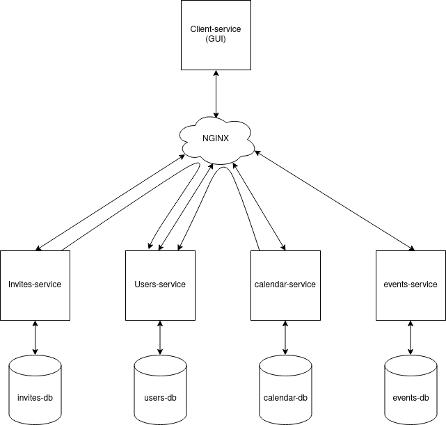

# DS Event-Calendar Application

## Get everything running
Running the code is very easy! Ensure you have Docker and Docker-compose installed. 
Then you only have to execute `chmod +x run.sh` in terminal to give run.sh the permission to be executed.
Now you can execute `./run.sh`! The project will build, requirements will be installed and the databases and tables will be created. 
Everything is set up now, so you can now access the GUI in the browser via the link http://0.0.0.0/web

## Microservice

As you can see there are 6 services, 4 real services and client as GUI and NGINX:
- client-service: Contains the frontend of the service
- NGINX: Functions as a dispatcher to route requests to the appropriate container
- invites-service: Handles everything concerning invitations for events of users
- users-service: Handles everything concerning the users: login, registration, ...
- calendar-service: Handles everything concerning calendars of users and sharing/shared calendars
- events-service: Handles everything concerning events: creating events, participants, ...

## Documentation
The documentation of the endpoints is split in different pages, one per service! You can access them with the 
links below (***Note you can only access them when the project is running!!!***)

- client-service: http://0.0.0.0/client-service/docs#/
- invites-service: http://0.0.0.0/invites-service/docs#/
- users-service: http://0.0.0.0/users-service/docs#/
- calendar-service: http://0.0.0.0/calendar-service/docs#/
- events-service: http://0.0.0.0/events-service/docs#/
